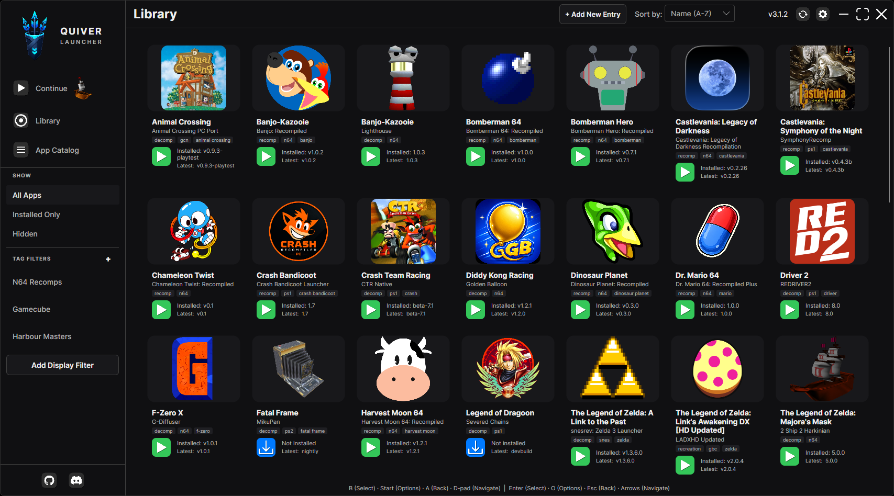

# Quiver Launcher

[](https://dotnet.microsoft.com/)
[](https://github.com/tgeorgiadis/quiver-launcher/blob/main/LICENSE)
[](https://github.com/tgeorgiadis/quiver-launcher/releases/latest/download/QuiverLauncher-win-Portable.zip)
[](https://github.com/tgeorgiadis/quiver-launcher/releases/latest)
[](https://github.com/tgeorgiadis/quiver-launcher/releases/latest/download/QuiverLauncher-android.apk)

[](https://discord.gg/5XRThpWHGk)
[](https://ko-fi.com/J1I2265MN5)

> **About** - **Quiver Launcher** is a fork of [GithubLauncher](https://github.com/SirDiabo/GithubLauncher), extended with the features I wanted: **tag filters**, **library management with App Catalog**, **mod management support**, **UI improvements** and more. It was rebranded from GithubLauncher to avoid using the GitHub trademark.



A modern launcher for downloading, installing, and running apps from GitHub and GitLab releases. With a personal library, community catalog subscriptions, and flexible filtering.

## Features

- **Tag filters** - Organize and filter your library with custom tags
- **Library search** - Filter the current list by name, tags, repository, or folder
- **Manually managed apps** - Add apps with no GitHub/GitLab repository; drop files into the app folder and open it from the library
- **App Catalog** - Subscribe to community app lists, review changes, and build your library from `apps.json`
- **GitHub & GitLab releases** - Install and update apps from GitHub or gitlab.com release assets
- **Mod Management Support** - Browse, install and update mods from Thunderstore and GameBanana
- **Automated updates** - Download and install the latest releases automatically
- **Version management** - Automatic version checking and in-app update checks
- **UI improvements** - Refined layout, catalog review workflow, and top-bar controls

## Getting Started

### Installation

**Note if you are upgrading from 2.4.x or older:** the in-app update cannot migrate Quiver Launcher 2.4.x onto version 3.0 or higher. Download a fresh 3.x version of Quiver Launcher and copy your library over. See [MIGRATING.md](MIGRATING.md).

**Windows**

1. Download `QuiverLauncher-win-Portable.zip` from [Releases](https://github.com/tgeorgiadis/quiver-launcher/releases)
2. Extract it
3. Run `QuiverLauncher.exe` from the extracted folder

Your library stays in that same folder (`apps.json`, `settings.json`, `Apps/`, `Cache/` next to `current/`), so you can move the whole directory wherever you want.

```
QuiverLauncher/
├── QuiverLauncher.exe          # launcher stub
├── current/            # app binaries (replaced on update)
├── apps.json
├── settings.json
├── Apps/
└── Cache/
```

To verify a signed `QuiverLauncher.exe`: right-click → Properties → Digital Signatures, or `Get-AuthenticodeSignature .\QuiverLauncher.exe` in PowerShell.

**Linux**

1. Download `QuiverLauncher-linux-x64.AppImage` or `QuiverLauncher-linux-arm64.AppImage` from [Releases](https://github.com/tgeorgiadis/quiver-launcher/releases)
2. Put the AppImage in its own folder (it creates library files beside itself), mark it executable, then run it:
   ```bash
   mkdir -p ~/QuiverLauncher
   mv QuiverLauncher*.AppImage ~/QuiverLauncher/
   cd ~/QuiverLauncher
   chmod +x QuiverLauncher*.AppImage
   ./QuiverLauncher*.AppImage
   ```
   Or right-click → Properties → Permissions → **Allow executing file as a program**.  
   GitHub downloads do not keep the executable bit; you need to set it locally after download.

Library data (`apps.json`, `settings.json`, `Apps/`, `Cache/`) is stored **beside the AppImage** so you can move that folder together. If the AppImage’s directory is not writable (e.g. `/usr/local/bin`), Quiver Launcher falls back to `~/.local/share/QuiverLauncher/` (or `$XDG_DATA_HOME/QuiverLauncher`).

```
MyFolder/
├── QuiverLauncher-linux-x64.AppImage
├── apps.json
├── settings.json
├── Apps/
└── Cache/
```

**macOS**

Currently macOS support is a work in progress.

1. Download the macOS package from [Releases](https://github.com/tgeorgiadis/quiver-launcher/releases)
2. Keep `QuiverLauncher.app` in a writable folder (not only `/Applications` if you want portable data)

Library data lives **beside** `QuiverLauncher.app` in that folder. If the parent directory is not writable, Quiver Launcher falls back to `~/Library/Application Support/QuiverLauncher/`.

```
MyFolder/
├── QuiverLauncher.app
├── apps.json
├── settings.json
├── Apps/
└── Cache/
```

### Library data and recovery

Quiver keeps verified library snapshots in `Backups/apps/` alongside `apps.json`
on Windows, Linux, macOS, and Android. See [library protection and recovery](docs/library-recovery.md) for how to restore a snapshot if the library becomes damaged.

## Basic Usage

1. Launch the application
2. On first launch, browse the Quiver Community App Catalog lists (internet required) and use **Review** or **View** to add apps to your library. You can also add apps later with **+ Add New Entry**, including **manually managed** apps that have no GitHub/GitLab repository. Your library is stored in local [`apps.json`](apps.json)
3. Browse your app library in the Library view
4. Click the Download/Launch button on the app/game you want to use

Catalog lists refresh on startup and via **Refresh All Sources**. New lists in the [community catalog repo](https://github.com/tgeorgiadis/quiver-community-app-catalog) appear automatically.

## Configuration

### GitHub / GitLab API Tokens
To avoid hitting API rate limits, you can provide personal access tokens in **Settings → Advanced**.

- **GitHub:** Create a classic token with no special permissions at GitHub Settings → Developer settings → Personal access tokens. Paste it into **GitHub API Token**.
- **GitLab (optional):** Create a personal access token with `read_api` at [GitLab personal access tokens](https://gitlab.com/-/user_settings/personal_access_tokens). Paste it into **GitLab API Token**. Public gitlab.com releases work without a token.

Do not share your tokens.

### Mods (Thunderstore & GameBanana)

Apps can expose a **Mods** browser when `mods.path` and `mods.sources` are set in the catalog entry (or via **+ Add New Entry**).

Optional `mods.layout`:

| Value | Behavior |
|-------|----------|
| *(omitted)* / `flat` | Extract archive paths as-is into the mods folder (default; typical for Thunderstore `.nrm` packs). |
| `folderPerMod` | If the archive has payload files at its root, wrap everything in a folder named from the download filename (e.g. `Music-FRLG.zip` → `mods/Music-FRLG/`). Archives that already use a top-level folder are left unchanged. |

Use `folderPerMod` for apps that expect each mod in its own subfolder. Enable it in the catalog JSON or with **Install each mod into its own folder** when editing an entry.

**Source URL formats** (one per line in Mod Sources):

| Provider | Examples |
|----------|----------|
| Thunderstore | `https://thunderstore.io/c/banjo-recompiled/` or slug `banjo-recompiled` |
| GameBanana | `https://gamebanana.com/mods/games/24774`, `https://gamebanana.com/games/24774`, or bare id `24774` |

GameBanana URLs are detected automatically (no `gamebanana|` prefix required). Other hosts can still use `provider|url`.

**Browse & search**

- Both sources support infinite scroll / load-more (mouse or gamepad). Multi-source search merges pages from each provider.
- Content-rated / NSFW mods are **hidden by default**. Use the **Include NSFW** chip to show them (persisted in settings).
- GameBanana mods with multiple download files show a file picker on Install/Update. **Zip**, **7z**, and **RAR** archives are supported.
- Thunderstore mods that list requirements prompt before install if those mods are not already installed. **Yes** installs the missing requirements (and the selected mod); **No** installs only the selected mod; **Cancel** aborts without installing anything. **Update All** still pulls missing requirements without prompting.

Remote index URL (the only catalog URL built into Quiver Launcher):

`https://raw.githubusercontent.com/tgeorgiadis/quiver-community-app-catalog/main/index.json`

List files live under `community-app-catalog/` in the [community catalog repo](https://github.com/tgeorgiadis/quiver-community-app-catalog). Quiver Launcher discovers them from the index at runtime. Each list file carries its own metadata (`name`, `description`, `version`) plus an `apps` array.

#### Community catalog index (v2)

The remote index is a registry of list IDs and fetch URLs only:

```json
{
  "version": 2,
  "lists": [
    {
      "id": "b4e8c2a1-3f5d-4e9b-8c7a-1d2e3f4a5b6c",
      "remoteLocation": "https://raw.githubusercontent.com/tgeorgiadis/quiver-community-app-catalog/main/community-app-catalog/N64-Recomps.json"
    }
  ]
}
```

#### Community catalog list file

Each list file defines the list metadata and its apps:

```json
{
  "name": "N64 Recomps",
  "description": "N64 recompilation ports",
  "version": "1.0.3",
  "apps": [
    {
      "name": "Example App",
      "repository": "username/example-app-repo",
      "folderName": "ExampleApp",
      "appIconUrl": null
    }
  ]
}
```

Quiver Launcher reads `name`, `description`, and `version` from the list file when a source is fetched or refreshed.

Use **App Catalog** anytime to review community entries and add the ones you want to your library. Installed app files on disk are never deleted automatically when you remove catalog entries or sources.

#### External catalog sources

You can add more catalogs in **App Catalog → Add Source** (remote raw GitHub URL or local file path). Each source is reviewed separately; your local `apps.json` takes priority when the same repository appears in multiple places.

When a subscribed list changes remotely, Quiver Launcher detects the diff on startup or when you click **Refresh All Sources**, then shows **Review changes** with per-app actions (Add, Replace, Merge, Ignore, Hide). Use **Not in library** to browse catalog apps you haven't added yet (including ignored ones). When every review item is synced or resolved, the catalog version is marked reviewed automatically. Use **Skip & mark reviewed** only to dismiss remaining items without syncing them.

**Merge** applies catalog metadata (name, icon, files, mods, and catalog tags) while keeping extra local tags and version pins (`preferredVersion`). **Replace** applies the same catalog fields but drops extra local tags. Neither overwrites `preferredVersion` unless the app is promoted, demoted, or retargeted to a different repository. Extra local tags and version pins do not keep an app in a "Changed" state.

See the [Quiver Community App Catalog](https://github.com/tgeorgiadis/quiver-community-app-catalog) repo for sample list format and the canonical community catalog.

#### App Entry Properties

Each app entry requires the following properties:

- **`name`** - Canonical app/title (for ports, usually the game name). Library display can compose this with `project` via Settings → Library name style
- **`project`** *(optional)* - Project, team, or author attribution shown when library name style includes project
- **`customDisplayName`** *(optional)* - Per-app library label override; always wins over name/project composition
- **`repository`** *(required unless manually managed)* - The repository path in the format `username/repository` (GitHub) or `namespace/project` (GitLab). The same repository may be used by more than one app when each has a distinct `folderName` (for example two games shipped in one GitHub release). Omit this field for **manually managed** apps: Quiver creates `{Apps}/{folderName}` and you place the files yourself. There is no download or update management until a repository is added. On **Edit App Entry**, filling in a repository promotes the app to a managed install (existing files are kept; Auto Update stays off until you update). Clearing the repository demotes it back to manual.
- **`repositorySource`** *(optional)* - `github` (default when omitted) or `gitlab`. Ignored for manually managed apps. Older Quiver Launcher versions ignore this field and treat entries as GitHub-only.
- **`folderName`** - The folder name under Apps where the app is installed (prefer `Title-Project`, without type suffixes like `-Recomp`). Must be unique. For manually managed apps this folder is created immediately as the drop target.
- **`releaseAssetFilter`** *(optional)* - Case-insensitive substring matched against release filenames. Use this when one repository ships more than one game so each app downloads only its files (e.g. `EXIT1` / `EXIT2`). Ignored for manually managed apps.
- **`tags`** *(optional)* - Freeform tags (classification such as `recomp` / `decomp` lives here, not in the title)
- **`appIconUrl`** - URL of the app's icon image. If null, a default icon will be used.

Catalog **list** JSON may also include review-chip hints (only shown when present on apps):

- **`preferredTagFilters`** — chips that appear first when reviewing that list, ordered by how often they appear on apps
- **`hiddenTagFilters`** — chips that never appear in that list's review filters (also omitted from frequency counts)
- **`featuredTags`** — fallback pin list when `preferredTagFilters` is omitted or empty

#### Example Configuration

```json
{
    "name": "Nintendo 64",
    "preferredTagFilters": ["recomp", "decomp", "recreation", "ai"],
    "hiddenTagFilters": ["n64", "nintendo"],
    "featuredTags": ["recomp", "decomp", "recreation", "ai"],
    "apps": [
        {
            "name": "Majora's Mask",
            "project": "2 Ship 2 Harkinian",
            "repository": "HarbourMasters/2ship2harkinian",
            "folderName": "MajorasMask-2Ship2Harkinian",
            "tags": ["n64", "decomp", "harbour-masters"],
            "appIconUrl": null
        },
        {
            "name": "Example App",
            "repository": "username/example-app-repo",
            "folderName": "ExampleApp",
            "appIconUrl": null
        },
        {
            "name": "GitLab Example App",
            "repository": "namespace/example-project",
            "repositorySource": "gitlab",
            "folderName": "GitLabExampleApp",
            "appIconUrl": null
        },
        {
            "name": "Manually Managed Example",
            "project": "Itch drop",
            "folderName": "ManualExample",
            "tags": ["manual"],
            "appIconUrl": null
        }
    ]
}
```

## Support

If you encounter any issues or have questions:
- [Open an issue](https://github.com/tgeorgiadis/quiver-launcher/issues)
- Check existing issues for solutions
- Join the [Discord server](https://discord.gg/5XRThpWHGk)


## For Developers: Local Development

When building and running from source, Quiver Launcher is not a packaged release install, so self-update checks no-op (and Debug builds always skip automatic checks). Set `QuiverLauncher_SKIP_UPDATES=1` (or `true`) to skip automatic checks in Release local runs as well.

```powershell
# Debug: no env var needed
dotnet run --project QuiverLauncher.Desktop/QuiverLauncher.Desktop.csproj -c Debug

# Release local testing
$env:QuiverLauncher_SKIP_UPDATES = "1"
dotnet run --project QuiverLauncher.Desktop/QuiverLauncher.Desktop.csproj -c Release
```

Requires the **.NET 10 SDK**.

### Android

Android uses a separate head project (`QuiverLauncher.Android`) that installs and launches **APK** release assets. Desktop binaries (.exe, AppImage, Wine/Proton) are not supported on device.

1. Install the .NET 10 SDK and the Android workload:
   ```powershell
   dotnet workload install android
   ```
2. Install the Android SDK and JDK 11+ ([Avalonia Android setup](https://docs.avaloniaui.net/docs/platform-specific-guides/android/)).
3. Allow **Install unknown apps** for Quiver on the emulator or device.
4. Build and deploy:
   ```powershell
   dotnet build QuiverLauncher.Android/QuiverLauncher.Android.csproj -c Debug
   ```

Games without an Android `.apk` asset stay in the catalog as “no Android build” rather than a failed download.

User data for unpackaged Windows debug builds still lives beside the build output. Unpackaged macOS/Linux runs (no AppImage / `.app` package) use the OS app-support fallbacks (`~/Library/Application Support/QuiverLauncher/` or `~/.local/share/QuiverLauncher/`).

### Automated tests

Fast local run (excludes the slow publish integration test; finishes in seconds):

```powershell
dotnet test QuiverLauncher.sln -c Release --filter "Category!=Slow" --logger "console;verbosity=normal"
```

Full suite including publish integration test (matches CI; the publish test can take several minutes):

```powershell
dotnet test QuiverLauncher.sln -c Release
```

Run only the slow publish packaging test:

```powershell
dotnet test QuiverLauncher.sln -c Release --filter "Category=Slow"
```

Test categories include catalog merge and sync, settings store round-trip, launcher version helpers, Windows runner command building, download asset selection, game status checks, ViewModel sorting/catalog helpers, GameManager hide/filter behavior, and Avalonia headless smoke tests.

Collect coverage locally with:

```powershell
dotnet test QuiverLauncher.sln -c Release --filter "Category!=Slow" --collect:"XPlat Code Coverage"
```
